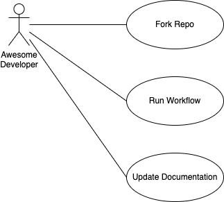

[<< Back](../README.md)

## Design
The software architecture diagram(s) and design(s).

### Introduction
The basic problem statmement that this project is to resolve.

### Architecture
#### Use Cases
Below is an example diagram drawn with the VS Code draw.io extension.

#### Class Diagrams & ERDs

#### Sequence Diagrams

### Performance Considerations

### Security Considerations

[<< Back](../README.md)